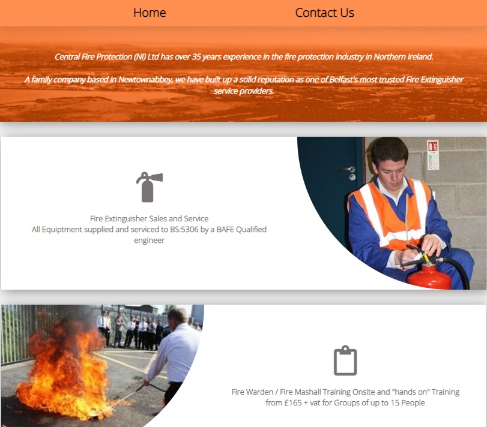
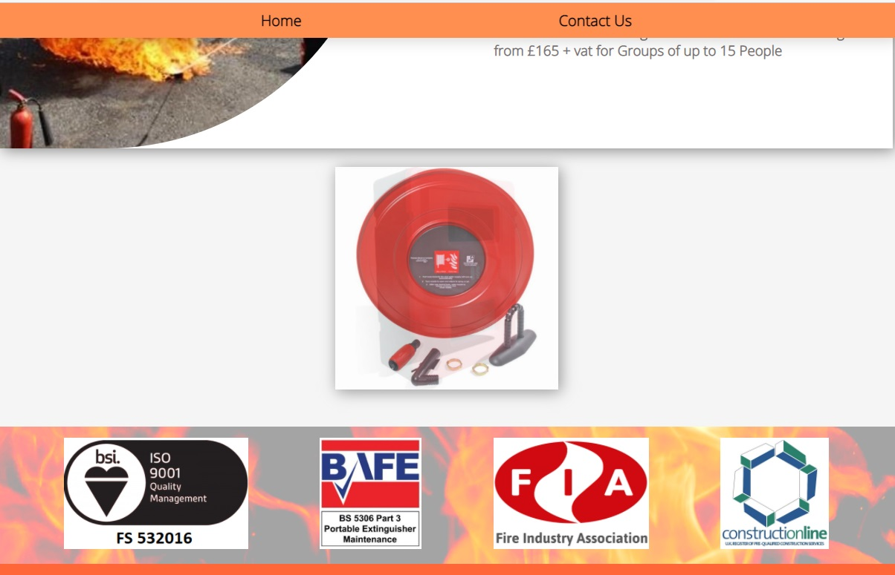

### WEBSITE – Fire Safety
 
 https://www.centralfirepro.com
  
 
  
I have built and deployed this website for a fire safety business.
  I have made it after attending an introductory course in web development.  
 
I have used JavaScript to create an automatic slideshow with fading images.
  
  

 
 

